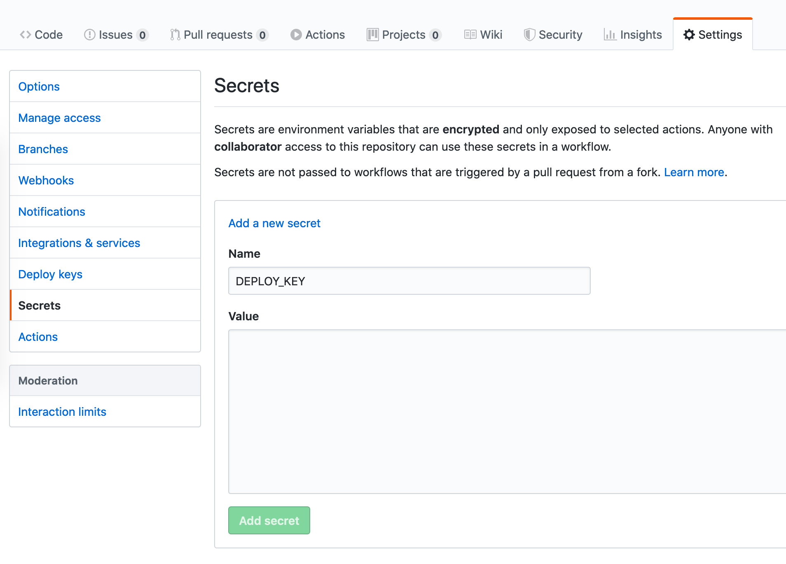
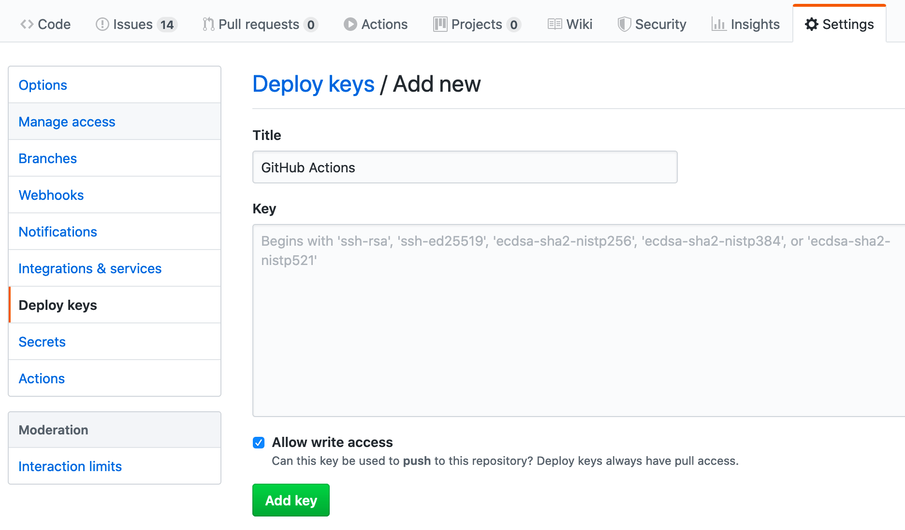

# GitHub Pages auto deployment

This project includes a GitHub Actions configuration that can automatically
deploy your specimen site to GitHub Pages.

Follow the following steps to enable it:

1. Generate an SSH deploy key on the command line:
   ```sh
   ssh-keygen -t ed25519 -f deploy-key -N ''
   ```
2. In GitHub navigate to the repository settings and create a secret named `DEPLOY_KEY`.
   As value, use the contents of the `deploy-key` file generated in step 1.
   
3. In GitHub add a deploy key (make sure to `Allow write access`!):
   
   As value, use the contents of the `deploy-key.pub` file created in step 1.  
   Make sure `Allow write access` is checked.
4. Edit `.github/workflows/ci.yml` to enable the deploy step for commits on the `master` branch:
   ```diff
      deploy:
   -    if: false && github.ref == 'refs/heads/master'
   +    if: github.ref == 'refs/heads/master'
        runs-on: ubuntu-latest
        needs: build
   ```
5. Done! 🙌

Now whenever you commit on master, your specimen site will automatically be deployed to GitHub pages.
